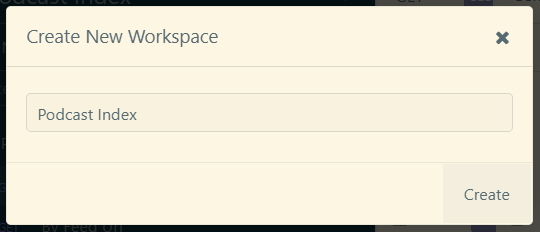
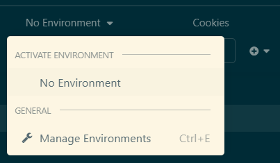
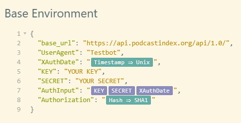
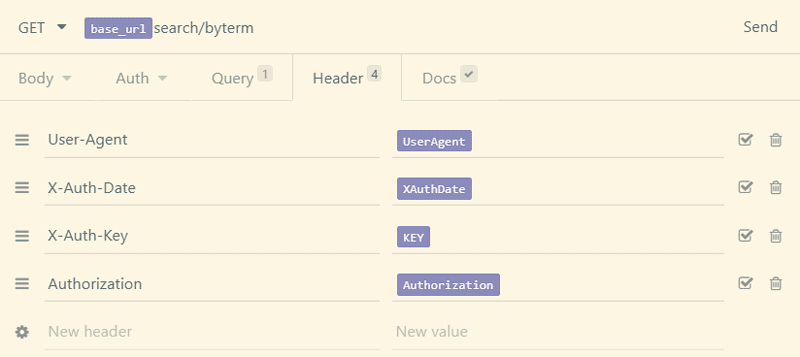
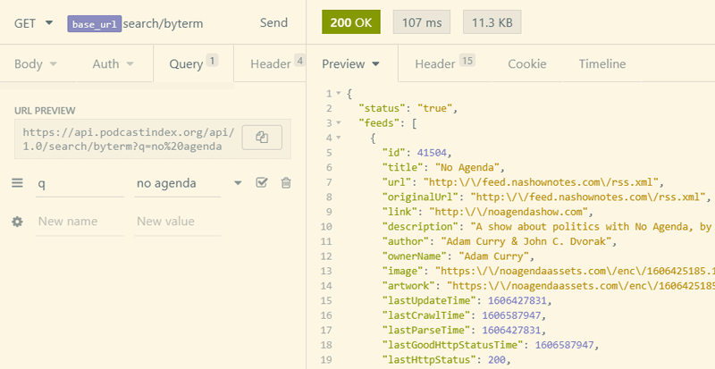
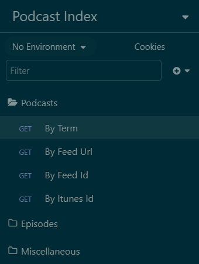
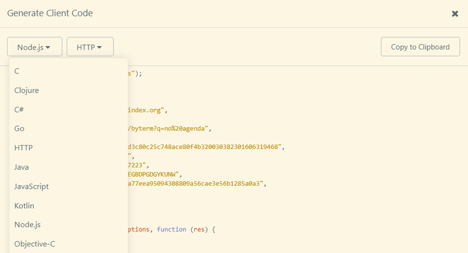

# {{icon}} {{ title }}
<time datetime="{{ date | dateIso }}">{{ date | dateReadable }}</time>

I've been listening to podcasts for years. Having struggled to find the best podcast player for my needs I've thought on a few occasions that I should just create my own player. One of the main issues would have been to come up with a full index of available podcasts though, and then to keep it updated. The fairly new [Podcast Index](http://www.podcastindex.org) project fixes this with their freely available REST Api.

The [documentation](https://podcastindex-org.github.io/docs-api/) on their site is good, but I wanted to show how to get started with the [Insomnia Core](https://insomnia.rest/download) client. I often use this program initially when starting a new project. It's a great way to quickly setup all the REST endpoints and then have it saved as a reference when you start to develop a program.

## Getting Started

You will need API keys, which will be given to you after you sign up on their [API Request page](https://api.podcastindex.org/).

Switching over to Insomnia, let's first create a new workspace titled **Podcast Index** so we have an area to start playing.

Every API is a little different in how they want you to authenticate. For Podcast Index everything will be done through the headers that are passed on each request. There are four pieces of information requested:

1. **User-Agent** - Since we are just testing, I'm going to enter "TestBox" for now.
2. **X-Auth-Date** - This will be the current time in Unix time. I will show how this is handled easily with Insomnia.
3. **X-Auth-Key** - This is the API key you get when you sign up.
4. **Authorization** - This is the only really tricky parameter. They are asking that we combine the following values (api key + api secret + Unix time). Once we get that value, we should perform a SHA1 hash of the value.

With Insomnia everything can be handled easily with environmental variables.

## Setting up Environment Variables

Click on the **No Environment** selection and then click on **Manage Environments**.

[Environment variables](https://support.insomnia.rest/article/18-environment-variables) are a powerful feature in Insomnia. You setup a JSON object with whatever makes sense to help you make requests.  Below you will see how I chose to setup my environment. Also, it is worth noting that Insomnia has a great auto-complete ability on any variables that you setup. Or any built in functions. For example, just typing in **time** let me chose the Unix Time shown under **XauthDate**.

* The **base_url** is what I will be using on all requests, minus the endpoint.
* I added the **key** and **secret** tags so I could build the **authInput** variable.
* The **authInput** variable is a concatenation of the three variables. It is then passed into the **Authorization** parameter which is hashed using a SHA1 algorithm.

Now that everything is setup we are ready to make our first request to the API!

## Setting up an Endpoint

Start by clicking the plus icon and setting up a new GET Request. Let's call it **Search Podcast by Term**. We'll be setting up the first example on the documentation page, which lets us search for a podcast by name.

This is where the environment variables shine. Now that they are setup, they will be autocompleted for us as we start to type them. We don't need to remember the full URL anymore. Just type in **base_url** and we are done. Finish off the URL by typing in the rest of the endpoint, which is **search/byterm**. Setup the rest of the header parameters as shown.

The last thing left to do now is to switch to the query tab and enter a search term. The documentation says to create a variable **q** with a value. Let's enter **No Agenda** as the search term. Hit the send button and the best podcast in the universe is returned!

Now that we have one request setup, it becomes much quicker to load the rest. You can right click on the first request we made and select duplicate. Change a few things like the URL, and a query parameter and the next request should load. The header information will stay the same for the rest of them. Before you know it you will have a list of API calls you can reference when developing an application.

## Generate Code

The last thing that might be of interest is that once you have a request in place, you can easily generate boilerplate code.
All you have to do is right click on the request and select **generate code**. There is a long list of languages available that should help out just about everyone.

## Final Thoughts

Now that we have a directory of API requests to make, hopefully this will inspire you to develop the next great podcast app. The Podcast Index is fairly new, so check back for future updates I'm sure. It's nice to see an independent index being setup that has no plans on banning or removing content and is just there to serve up a list. Any application can choose to do with it what they want.